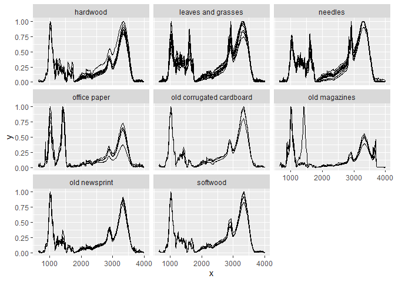

<!-- README.md is generated from README.Rmd. Please edit that file -->

# ir 

<!-- badges: start -->

[](https://zenodo.org/badge/latestdoi/234117897)
[](https://lifecycle.r-lib.org/articles/stages.html#stable)
<!-- badges: end -->

## Overview

‘ir’ is an R package that contains simple functions to import, handle
and preprocess infrared spectra. Infrared spectra are stored as list
columns in data frames to enable efficient storage of metadata along
with the spectra and support further analyses containing other data for
the same samples.

**Supported file formats for import are:**

1.  .csv files with individual spectra.
2.  Thermo Galactic’s .spc files with individual spectra.

**Provided functions for preprocessing and general handling are:**

1.  baseline correction with:
      - a polynomial baseline
      - a convex hull baseline
      - a Savitzky-Golay baseline (Lasch 2012).
2.  binning.
3.  clipping.
4.  interpolating (resampling, linearly).
5.  replacing selected parts of a spectrum by a straight line.
6.  averaging spectra within specified groups.
7.  normalizing spectra:
      - to the maximum intensity
      - to the intensity at a specific x value
      - so that all intensity values sum to 1.
8.  smoothing:
      - Savitzky-Golay smoothing
      - Fourier smoothing.
9.  computing derivatives of spectra using Savitzky-Golay smoothing.
10. mathematical transformations (addition, subtraction, multiplication,
    division).
11. computing the variance of intensity values (optionally after
    subtracting reference spectra).
12. computing maxima, minima, median, and ranges of intensity values of
    spectra.
13. plotting.
14. [tidyverse](https://www.tidyverse.org/) methods.

### How to install

You can install ‘ir’ from CRAB using R via:

``` r
install.packages("ir")
```

You can install ‘ir’ from GitHub using R via:

``` r
remotes::install_github(repo = "henningte/ir")
```

### How to use

You can load ‘ir’ in R with:

``` r
# load ir package
library(ir)

# load additional packages needed for this tutorial
library(ggplot2)
#> Warning: package 'ggplot2' was built under R version 4.0.5
```

For brief introductions, see below and the two vignettes:

1.  [Introduction to the ‘ir’ package](vignettes/ir-introduction.Rmd)
2.  [Introduction to the `ir`class](vignettes/ir-class.Rmd)

#### Sample workflow

A simple workflow would be, for example, to baseline correct the
spectra, then bin them to bins with a width of 10 wavenumber units, then
normalize them so that the maximum intensity value is 1 and the minimum
intensity value is 0 and then plot the baseline corrected spectra for
each sample and sample type. Here’s the ‘ir’ code using the built-in
sample data `ir_sample_data`.

``` r
ir_sample_data %>%                                      # data
  ir::ir_bc(method = "rubberband") %>%                  # baseline correction
  ir::ir_bin(width = 10) %>%                            # binning
  ir::ir_normalize(method = "zeroone") %>%              # normalization
  plot() + ggplot2::facet_wrap(~ sample_type)           # plot
```

<!-- -->

#### Data structure

You can load the sample data with:

``` r
ir::ir_sample_data
#> # A tibble: 58 x 7
#>    id_measurement id_sample sample_type sample_comment             klason_lignin
#>             <int> <chr>     <chr>       <chr>                      <units>      
#>  1              1 GN 11-389 needles     Abies Firma Momi fir       0.359944     
#>  2              2 GN 11-400 needles     Cupressocyparis leylandii~ 0.339405     
#>  3              3 GN 11-407 needles     Juniperus chinensis Chine~ 0.267552     
#>  4              4 GN 11-411 needles     Metasequoia glyptostroboi~ 0.350016     
#>  5              5 GN 11-416 needles     Pinus strobus Torulosa     0.331100     
#>  6              6 GN 11-419 needles     Pseudolarix amabili Golde~ 0.279360     
#>  7              7 GN 11-422 needles     Sequoia sempervirens Cali~ 0.329672     
#>  8              8 GN 11-423 needles     Taxodium distichum Cascad~ 0.356950     
#>  9              9 GN 11-428 needles     Thuja occidentalis Easter~ 0.369360     
#> 10             10 GN 11-434 needles     Tsuga caroliniana Carolin~ 0.289050     
#> # ... with 48 more rows, and 2 more variables: holocellulose <units>,
#> #   spectra <named list>
```

`ir_sample_data` is an object of class `ir`. An Object of class `ir` is
basically a data frame where each row represents one infrared
measurement and column `spectra` contains the infrared spectra (one per
row). This allows effectively storing repeated measurements for the same
sample in the same table, as well as any metadata and accessory data
(e.g. nitrogen content of the sample).

The column `spectra` is a list column of data frames, meaning that each
cell in `sample_data` contains for column `spectra` a data frame. For
example, the first element of `ir_sample_data$spectra` represents the
first spectrum as a data frame:

``` r
# View the first ten rows of the first spectrum in ir_sample_data
ir::ir_get_spectrum(ir_sample_data, what = 1)[[1]] %>% 
  head(10)
#> # A tibble: 10 x 2
#>        x        y
#>    <int>    <dbl>
#>  1  4000 0.000361
#>  2  3999 0.000431
#>  3  3998 0.000501
#>  4  3997 0.000571
#>  5  3996 0.000667
#>  6  3995 0.000704
#>  7  3994 0.000612
#>  8  3993 0.000525
#>  9  3992 0.000502
#> 10  3991 0.000565
```

Column `x` represents the x values (in this case wavenumbers
\[cm<sup>-1</sup>\]) and column `y` the corresponding intensity values.

### How to cite

Please cite this R package as:

> Henning Teickner (2022). *ir: Functions to Handle and Preprocess
> Infrared Spectra*. DOI: 10.5281/zenodo.5747170. Accessed 21 Apr 2022.
> Online at <https://zenodo.org/record/5747170>.

### Companion packages

[irpeat](https://github.com/henningte/irpeat/) builds on ‘ir’. irpeat
provides functions to analyze infrared spectra of peat (humification
indices, prediction models).

### Licenses

**Text and figures :** [CC
BY 4.0](https://creativecommons.org/licenses/by/4.0/)

**Code :** See the [DESCRIPTION](DESCRIPTION) file

**Data :** [CC BY 4.0](https://creativecommons.org/licenses/by/4.0/)
attribution requested in reuse. See the sources section for data sources
and how to give credit to the original author(s) and the source.

### Contributions

We welcome contributions from everyone. Before you get started, please
see our [contributor guidelines](CONTRIBUTING.md). Please note that this
project is released with a [Contributor Code of Conduct](CONDUCT.md). By
participating in this project you agree to abide by its terms.

### Sources

The complete data in this package is derived from Hodgkins et al. (2018)
and was restructured to match the requirements of ‘ir’. The original
article containing the data can be downloaded from
<https://www.nature.com/articles/s41467-018-06050-2> and is distributed
under the Creative Commons Attribution 4.0 International License
(<https://creativecommons.org/licenses/by/4.0/>). The data on Klason
lignin and holocellulose content was originally derived from De La Cruz,
Florentino B., Osborne, and Barlaz (2016).

This packages was developed in R (R version 4.0.1 (2020-06-06)) (R Core
Team 2019) using functions from devtools (Wickham, Hester, and Chang
2019), usethis (Wickham and Bryan 2019), rrtools (Marwick 2019) and
roxygen2 (Wickham et al. 2019).

### References

<div id="refs" class="references hanging-indent">

<div id="ref-LaCruz.2016">

De La Cruz, Florentino B., Jason Osborne, and Morton A. Barlaz. 2016.
“Determination of Sources of Organic Matter in Solid Waste by Analysis
of Phenolic Copper Oxide Oxidation Products of Lignin.” *Journal of
Environmental Engineering* 142 (2): 04015076.
<https://doi.org/10.1061/(ASCE)EE.1943-7870.0001038>.

</div>

<div id="ref-Hodgkins.2018">

Hodgkins, Suzanne B., Curtis J. Richardson, René Dommain, Hongjun Wang,
Paul H. Glaser, Brittany Verbeke, B. Rose Winkler, et al. 2018.
“Tropical peatland carbon storage linked to global latitudinal trends
in peat recalcitrance.” *Nature communications* 9 (1): 3640.
<https://doi.org/10.1038/s41467-018-06050-2>.

</div>

<div id="ref-Lasch.2012">

Lasch, Peter. 2012. “Spectral Pre-Processing for Biomedical Vibrational
Spectroscopy and Microspectroscopic Imaging.” *Chemometrics and
Intelligent Laboratory Systems* 117 (August): 100–114.
<https://doi.org/10.1016/j.chemolab.2012.03.011>.

</div>

<div id="ref-Marwick.2019">

Marwick, Ben. 2019. “rrtools: Creates a Reproducible Research
Compendium.” <https://github.com/benmarwick/rrtools>.

</div>

<div id="ref-RCoreTeam.2019">

R Core Team. 2019. “R: A Language and Environment for Statistical
Computing.” Vienna, Austria: R Foundation for Statistical Computing.
<https://www.R-project.org/>.

</div>

<div id="ref-Wickham.2019b">

Wickham, Hadley, and Jennifer Bryan. 2019. “usethis: Automate Package
and Project Setup.” <https://CRAN.R-project.org/package=usethis>.

</div>

<div id="ref-Wickham.2019c">

Wickham, Hadley, Peter Danenberg, Gábor Csárdi, and Manuel Eugster.
2019. “roxygen2: In-Line Documentation for R.”
<https://CRAN.R-project.org/package=roxygen2>.

</div>

<div id="ref-Wickham.2019">

Wickham, Hadley, Jim Hester, and Winston Chang. 2019. “devtools: Tools
to Make Developing R Packages Easier.”
<https://CRAN.R-project.org/package=devtools>.

</div>

</div>
