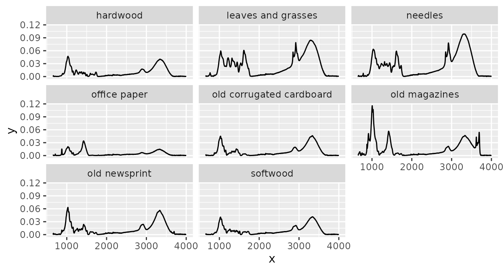
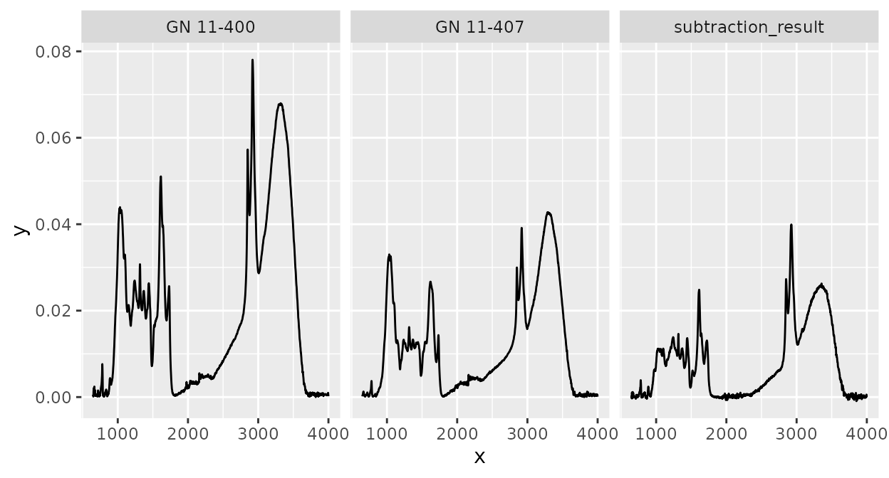

# Introduction to the \`ir\`class

## Introduction

### Purpose

The purpose of this vignette is to describe the structure and methods of
objects of class `ir`. `ir` objects are used by the ‘ir’ package to
store spectra and their metadata. This vignette could be helpful if you
want to understand better how the ‘ir’ package works, how to handle
metadata, how to manipulate `ir` objects, or if you want to construct a
subclass based on the `ir`class.

This vignette does not give an overview on how to use the ‘ir’ package,
on functions for spectral preprocessing, and on how to plot `ir`
objects. For this, see vignette [Introduction to the ‘ir’
package](https://henningte.github.io/ir/articles/ir-introduction.md).

### Structure

This vignette has three parts:

1.  The `ir` class
2.  Subsetting and modifying `ir` objects
3.  Special functions to manipulate `ir objects`

In part [The `ir` class](#the-ir-class), I will describe the structure
of `ir` objects and list available methods for it.

In part [Subsetting and modifying `ir`
objects](#subsetting-and-modifying-ir-objects), I will show how `ir`
objects can be subsetted and modified (including tidyverse functions).

In part [Special functions to manipulate
`ir objects`](#special-functions-to-manipulate-ir-objects), I will
present some more specialized functions to manipulate the data in `ir`
objects (including the spectra).

### Preparation

To follow this vignette, you have to install the ‘ir’ package as
described in the Readme file and you have to load it:

``` r
library(ir)
```

## The `ir` class

Objects of class `ir` are in principle data frames (or `tibble`s):

``` r
ir_sample_data
```

Each row represents one measurement for a spectrum. The `ir` object must
a column `spectra` which is a list of data frames, each element
representing a spectrum.

Besides this, `ir` objects may have additional columns with metadata.
This is useful to analyze spectra of samples in an integrated way with
other data, for example nitrogen content (see part [Subsetting and
modifying `ir` objects](#subsetting-and-modifying-ir-objects)).

The `spectra` column is a list of data frames, each element representing
a spectrum. The data frames have a row for each intensity values
measured for a spectral channel (“x axis value”, e.g. wavenumber) and a
column `x` storing the wavenumber values and a column `y` storing the
respective intensity values. No additional columns are allowed:

``` r
head(ir_sample_data$spectra[[1]])
#> # A tibble: 6 × 2
#>       x        y
#>   <int>    <dbl>
#> 1  4000 0.000361
#> 2  3999 0.000431
#> 3  3998 0.000501
#> 4  3997 0.000571
#> 5  3996 0.000667
#> 6  3995 0.000704
```

If there is no spectrum available for a sample, an empty data frame is a
placeholder:

``` r
d <- ir_sample_data
d$spectra[[1]] <- d$spectra[[1]][0, ]
d$spectra[[1]]

ir_normalize(d, method = "area")
```

    #> # A tibble: 0 × 2
    #> # ℹ 2 variables: x <int>, y <dbl>

Currently, the following methods are available for `ir` objects:

``` r
methods(class = "ir")
#>  [1] [        [[       [[<-     [<-      $        $<-      cbind    filter  
#>  [9] ir_as_ir max      median   min      Ops      plot     range    rbind   
#> [17] rep     
#> see '?methods' for accessing help and source code
```

## Subsetting and modifying `ir` objects

### Subsetting works as for data frames

Since `ir` objects are data frames, subsetting and modifying works the
same way as for data frames. For example, specific rows (= measurements)
can be filtered:

``` r
ir_sample_data[5:10, ]
```

The advantage of storing spectra as list columns is that filtering
spectral data and metadata and other data can be performed
simultaneously.

One exception is that while subsetting, one must not remove the
`spectra` column. If it is removed, the `ir` class attribute is dropped:

``` r
d1 <- ir_sample_data

class(d1[, setdiff(colnames(d), "id_sample")])
#> [1] "ir"         "tbl_df"     "tbl"        "data.frame"

d1$spectra <- NULL
class(d1)
#> [1] "tbl_df"     "tbl"        "data.frame"
```

Another exception is that when the `spectra` column contains unsupported
elements (e.g. wrong column names, additional columns, duplicated “x
axis values”), the object also loses its `ir` class:

``` r
d2 <- ir_sample_data
d2$spectra[[1]] <- rep(d2$spectra[[1]], 2)
class(d2)
#> [1] "tbl_df"     "tbl"        "data.frame"

d3 <- ir_sample_data
colnames(d3$spectra[[1]]) <- c("a", "b")
class(d3)
#> [1] "tbl_df"     "tbl"        "data.frame"
```

### Tidyverse methods are supported

Tidyverse methods for manipulating ir objects are also supported. For
example, we can use `mutate` to add new variables and we can use pipes
(`%>%`) to make coding and reading code easier:

``` r
library(dplyr)
#> 
#> Attaching package: 'dplyr'
#> The following objects are masked from 'package:stats':
#> 
#>     filter, lag
#> The following objects are masked from 'package:base':
#> 
#>     intersect, setdiff, setequal, union

d <- ir_sample_data

d <- 
  d |>
  mutate(a = rnorm(n = length(spectra)))
  
head(ir_sample_data)
```

Or, a another example, we can summarize spectra for some defined groups
(here the maximum intensity value for each “x axis value” and unique
`sample_type` value):

``` r
library(purrr)
library(ggplot2)

d2 <- 
  d |>
  group_by(sample_type) |>
  summarize(
    spectra = {
      res <- map_dfc(spectra, function(.x) .x[, 2, drop = TRUE])
      spectra[[1]] |>
        dplyr::mutate(
          y =
            res |>
            rowwise() |>
            mutate(y = max(c_across(everything()))) |>
            pull(y)
        ) |>
        list()
    },
    .groups = "drop"
  )

plot(d2) + 
  facet_wrap(~ sample_type)
```



## Special functions to manipulate `ir objects`

There are some more special functions to manipulate `ir` objects which
are not described in vignette [Introduction to the ‘ir’
package](https://henningte.github.io/ir/articles/ir-introduction.md).
These will be described here.

### Replicating data

Sometimes, it is useful to replicate one or multiple measurements. This
can be done with the [`rep()`](https://rdrr.io/r/base/rep.html) method
for `ir` objects. For example, we can replicate the second spectrum in
`ir_sample_data`:

``` r
ir_sample_data |>
  slice(2) |>
  rep(20)
```

### Calculating with spectra

The `ir` packages supports arithmetic operations with spectra,
i.e. addition, subtraction, multiplication, and division of intensity
values with the same “x axis values”. For example, we can subtract the
third spectrum in `ir_sample_data` from the second:

``` r
ir_sample_data |>
  slice(2) |>
  ir_subtract(y = ir_sample_data[3, ]) |>
  dplyr::mutate(id_sample = "subtraction_result") |>
  rbind(ir_sample_data[2:3, ]) |>
  plot() + 
  facet_wrap(~ id_sample)
```



Note that all metadata of the first argument (`x`) will be retained, but
not of the second (`y`). This is why we had to manually change
`id_sample` before `rbind`ing the other spectra above. Note also that
`x` can contain multiple spectra, `y` must either only contain one
spectrum or the same number of spectra as `x` in which case spectra of
matching rows are subtracted (added, multiplied, divided):

``` r
# This will not work
ir_sample_data |>
  slice(6) |>
  ir_add(y = ir_sample_data[3:4, ])
#> Error in `ir_prepare_Ops()`:
#> ! `y` must either have only one row or as many rows as `x`.

# but this will
ir_sample_data |>
  slice(2:6) |>
  ir_add(y = ir_sample_data[3, ]) 
#> # A tibble: 5 × 7
#>   id_measurement id_sample sample_type sample_comment              klason_lignin
#> *          <int> <chr>     <chr>       <chr>                       <units>      
#> 1              2 GN 11-400 needles     Cupressocyparis leylandii … 0.339405     
#> 2              3 GN 11-407 needles     Juniperus chinensis Chines… 0.267552     
#> 3              4 GN 11-411 needles     Metasequoia glyptostroboid… 0.350016     
#> 4              5 GN 11-416 needles     Pinus strobus Torulosa      0.331100     
#> 5              6 GN 11-419 needles     Pseudolarix amabili Golden… 0.279360     
#> # ℹ 2 more variables: holocellulose <units>, spectra <list>
```

Note that arithmetic operations are also available as infix operators,
i.e. it is possible to compute:

``` r
ir_sample_data[2, ] + ir_sample_data[3, ]
#> # A tibble: 1 × 7
#>   id_measurement id_sample sample_type sample_comment              klason_lignin
#> *          <int> <chr>     <chr>       <chr>                       <units>      
#> 1              2 GN 11-400 needles     Cupressocyparis leylandii … 0.339405     
#> # ℹ 2 more variables: holocellulose <units>, spectra <list>
ir_sample_data[2, ] - ir_sample_data[3, ]
#> # A tibble: 1 × 7
#>   id_measurement id_sample sample_type sample_comment              klason_lignin
#> *          <int> <chr>     <chr>       <chr>                       <units>      
#> 1              2 GN 11-400 needles     Cupressocyparis leylandii … 0.339405     
#> # ℹ 2 more variables: holocellulose <units>, spectra <list>
ir_sample_data[2, ] * ir_sample_data[3, ]
#> # A tibble: 1 × 7
#>   id_measurement id_sample sample_type sample_comment              klason_lignin
#> *          <int> <chr>     <chr>       <chr>                       <units>      
#> 1              2 GN 11-400 needles     Cupressocyparis leylandii … 0.339405     
#> # ℹ 2 more variables: holocellulose <units>, spectra <list>
ir_sample_data[2, ] / ir_sample_data[3, ]
#> # A tibble: 1 × 7
#>   id_measurement id_sample sample_type sample_comment              klason_lignin
#> *          <int> <chr>     <chr>       <chr>                       <units>      
#> 1              2 GN 11-400 needles     Cupressocyparis leylandii … 0.339405     
#> # ℹ 2 more variables: holocellulose <units>, spectra <list>
```

## Further information

Many more functions and options to handle and process spectra are
available in the ‘ir’ package. These are described in the documentation.
In the documentation, you can also read more details about the functions
and options presented here.  
To learn more about how `ir` objects can be useful can be plotted, and
the spectral preprocessing functions, see the vignette [Introduction to
the ‘ir’
package](https://henningte.github.io/ir/articles/ir-introduction.md).

## Sources

The data contained in the `csv` file used in this vignette are derived
from Hodgkins et al. (2018)

## Session info

    #> R version 4.5.2 (2025-10-31)
    #> Platform: x86_64-pc-linux-gnu
    #> Running under: Ubuntu 24.04.3 LTS
    #> 
    #> Matrix products: default
    #> BLAS:   /usr/lib/x86_64-linux-gnu/openblas-pthread/libblas.so.3 
    #> LAPACK: /usr/lib/x86_64-linux-gnu/openblas-pthread/libopenblasp-r0.3.26.so;  LAPACK version 3.12.0
    #> 
    #> locale:
    #>  [1] LC_CTYPE=C.UTF-8       LC_NUMERIC=C           LC_TIME=C.UTF-8       
    #>  [4] LC_COLLATE=C.UTF-8     LC_MONETARY=C.UTF-8    LC_MESSAGES=C.UTF-8   
    #>  [7] LC_PAPER=C.UTF-8       LC_NAME=C              LC_ADDRESS=C          
    #> [10] LC_TELEPHONE=C         LC_MEASUREMENT=C.UTF-8 LC_IDENTIFICATION=C   
    #> 
    #> time zone: UTC
    #> tzcode source: system (glibc)
    #> 
    #> attached base packages:
    #> [1] stats     graphics  grDevices utils     datasets  methods   base     
    #> 
    #> other attached packages:
    #> [1] ggplot2_4.0.1 purrr_1.2.1   dplyr_1.1.4   ir_0.4.1     
    #> 
    #> loaded via a namespace (and not attached):
    #>  [1] tidyr_1.3.2         sass_0.4.10         utf8_1.2.6         
    #>  [4] generics_0.1.4      xml2_1.5.2          hyperSpec_0.100.3  
    #>  [7] jpeg_0.1-11         lattice_0.22-7      digest_0.6.39      
    #> [10] magrittr_2.0.4      evaluate_1.0.5      grid_4.5.2         
    #> [13] RColorBrewer_1.1-3  fastmap_1.2.0       jsonlite_2.0.0     
    #> [16] brio_1.1.5          scales_1.4.0        lazyeval_0.2.2     
    #> [19] textshaping_1.0.4   jquerylib_0.1.4     Rdpack_2.6.5       
    #> [22] cli_3.6.5           rlang_1.1.7         rbibutils_2.4.1    
    #> [25] withr_3.0.2         cachem_1.1.0        yaml_2.3.12        
    #> [28] otel_0.2.0          tools_4.5.2         deldir_2.0-4       
    #> [31] interp_1.1-6        vctrs_0.7.1         R6_2.6.1           
    #> [34] png_0.1-8           lifecycle_1.0.5     fs_1.6.6           
    #> [37] htmlwidgets_1.6.4   ragg_1.5.0          pkgconfig_2.0.3    
    #> [40] desc_1.4.3          pkgdown_2.2.0       pillar_1.11.1      
    #> [43] bslib_0.10.0        gtable_0.3.6        glue_1.8.0         
    #> [46] Rcpp_1.1.1          systemfonts_1.3.1   xfun_0.56          
    #> [49] tibble_3.3.1        tidyselect_1.2.1    knitr_1.51         
    #> [52] latticeExtra_0.6-31 farver_2.1.2        htmltools_0.5.9    
    #> [55] labeling_0.4.3      rmarkdown_2.30      testthat_3.3.2     
    #> [58] compiler_4.5.2      S7_0.2.1

## References

Hodgkins, Suzanne B., Curtis J. Richardson, René Dommain, Hongjun Wang,
Paul H. Glaser, Brittany Verbeke, B. Rose Winkler, et al. 2018.
“Tropical Peatland Carbon Storage Linked to Global Latitudinal Trends in
Peat Recalcitrance.” *Nature Communications* 9 (1): 3640.
<https://doi.org/10.1038/s41467-018-06050-2>.
