# Introduction to the 'ir' package

## Introduction

### Purpose

This vignette shows how to use main functions of the ‘ir’ package. This
includes data import, data export, functions for spectral preprocessing,
and functions for plotting. This vignette does not explain the data
structure of `ir` objects (the objects ‘ir’ uses to store spectra) in
detail and it does not describe general data manipulation functions
(e.g. subsetting rows or columns, modifying variables) (for this, see
vignette [Introduction to the
`ir`class](https://henningte.github.io/ir/articles/ir-class.md)). This
vignette also does not explain the purpose of the spectral preprocessing
functions, it just shows how to use them.

### Structure

The vignette has three parts:

1.  Data import and export
2.  Plotting spectra
3.  Spectral preprocessing

In part [Data import and export](#data-import-and-export), I will show
how to import spetra from `csv` files and how to import spetra from
Thermo Galactic’s spectral files (file extension `.spc`). I will also
show how to export `ir` objects as `csv` files. To this end, I will use
sample data which comes along with the ‘ir’ package. In part [Plotting
spectra](#plotting-spectra), I will show how to create simple plots of
spectra and how these plots can be modified (for example to produce nice
graphs for publications). In part [Spectral
preprocessing](#spectral-preprocessing) I will show the main
preprocessing functions included in the ‘ir’ package and they can be
combined to form preprocessing pipelines of increasing complexity.

### Preparation

To follow this vignette, you have to install the ‘ir’ package as
described in the Readme file and you have to load it:

``` r
library(ir)
```

## Data import and export

### Data import

To test importing spectra from files, I’ll use sample data provided in
the ‘ir’ package (in folder `inst/extdata`). First, I’ll show how to
import spectra from `csv` files and then how to import Thermo Galactic’s
spectral files (file extension `.spc`).

#### `csv` files

Spectra from `csv` files can be imported with
[`ir_import_csv()`](https://henningte.github.io/ir/reference/ir_import_csv.md).
This function can import spectra from one or more `csv` files with the
following format:

| wavenumber | GN.11.389 | GN.11.400 | GN.11.407 | GN.11.411 |
|-----------:|----------:|----------:|----------:|----------:|
|       4000 | 0.0003612 | 0.0001991 | 0.0001044 | 0.0001983 |
|       3999 | 0.0004313 | 0.0003787 | 0.0002027 | 0.0002307 |
|       3998 | 0.0005014 | 0.0005583 | 0.0003203 | 0.0002631 |
|       3997 | 0.0005712 | 0.0007378 | 0.0003938 | 0.0002954 |
|       3996 | 0.0006667 | 0.0009148 | 0.0004075 | 0.0003405 |
|       3995 | 0.0007045 | 0.0009870 | 0.0004077 | 0.0003683 |

This is a subset of the data we will import in a few moments. The first
column must contain spectral channel values (“x axis values”,
e.g. wavenumbers for mid infrared spectra), and each additional column
represents the intensity values (“y axis values”, e.g. absorbances) of
one spectrum. In the example above, there are four spectra in the `csv`
file.

To import the data, you can simply pass the path to the file to
[`ir_import_csv()`](https://henningte.github.io/ir/reference/ir_import_csv.md):

``` r
d_csv <- 
  ir_import_csv(
    "../inst/extdata/klh_hodgkins_mir.csv", 
    sample_id = "from_colnames"
  )
```

The argument `sample_id = "from_colnames"` tells
[`ir_import_csv()`](https://henningte.github.io/ir/reference/ir_import_csv.md)
to extract names for the spectra from the column names of the `csv`
file.

If you have additional metadata available, you can bind these to the
`ir` object in a second step (note: here, I use functions from the
[‘dplyr’](https://dplyr.tidyverse.org/) package to reformat the
metadata; you don’t need to understand the details of this data cleanup
to follow the rest of this vignette):

``` r
library(dplyr)
#> 
#> Attaching package: 'dplyr'
#> The following object is masked from 'package:kableExtra':
#> 
#>     group_rows
#> The following objects are masked from 'package:stats':
#> 
#>     filter, lag
#> The following objects are masked from 'package:base':
#> 
#>     intersect, setdiff, setequal, union
library(stringr)

# import the metadata
d_csv_metadata <- 
  read.csv(
    "./../inst/extdata/klh_hodgkins_reference.csv",
    header = TRUE,
    as.is = TRUE
  ) |>
  dplyr::rename(
    sample_id = "Sample.Name",
    sample_type = "Category",
    comment = "Description",
    holocellulose = "X..Cellulose...Hemicellulose..measured.",
    klason_lignin = "X..Klason.lignin..measured." 
  ) |>
  # make the sample_id values fit to those in `d_csv$sample_id` to make combining easier
  dplyr::mutate(
    sample_id =
      sample_id |>
      stringr::str_replace_all(pattern = "( |-)", replacement = "\\.")
  )

d_csv <- 
  d_csv |>
  dplyr::full_join(d_csv_metadata, by = "sample_id")
```

Now, `d_csv` has addition columns with the metadata contained in the
separate file.

#### Thermo Galactic’s `spc` files

Spectra from `spc` files can be imported with
[`ir_import_spc()`](https://henningte.github.io/ir/reference/ir_import_spc.md).
This function can import spectra from one or more `spc` files:

``` r
d_spc <- ir_import_spc("../inst/extdata/1.spc", log.txt = FALSE)
```

In this case, names for the spectra and other metadata are extracted
from the `spc` file(s) and added to the `ir` object. You can inspect
`d_spc` to see these additional variables. The option `log.txt = FALSE`
means that some of the metadata will not be imported. To import these
additional metadata, you need to install version 0.200.0.9000 or higher
of the ‘hyperSpec’ package, which is currently only available from
GitHub (<https://github.com/r-hyperspec/hyperSpec>).

### Data export

Data in `ir` objects can be exported in many ways. Here, I show how to
export spectra to a `csv` file. The result has the same format as the
sample data we imported in subsection [`csv` files](#csv-files).

To export the spectra, type:

``` r
# export only the spectra
ir_sample_data |>
  ir_export_prepare(what = "spectra") |>
  write.csv(tempfile("ir_sample_data_spectra", fileext = "csv"), row.names = FALSE)
```

To export the additional metadata contained in an `ir` object, type:

``` r
# export only the metadata
ir_sample_data |>
  ir_drop_spectra() |>
  write.csv(tempfile("ir_sample_data_metadata", fileext = "csv"), row.names = FALSE)
```

This exports the metadata to a separate `csv` file with the same row and
column format as in `ir_sample_data`.

## Plotting spectra

The ‘ir’ package provides a function to create simple plots of spectra:

``` r
plot(d_csv)
```

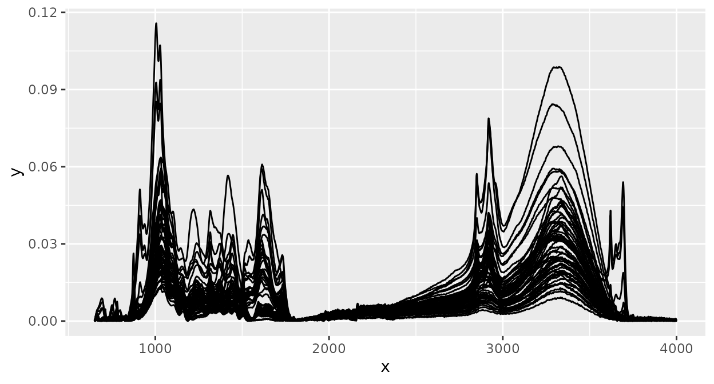

This will plot the intensity values (“y axis values”, e.g. absorbances)
of each spectrum versus the spectral channel values (“x axis values”,
e.g. wavenumbers), connected by a line. All spectra in an `ir` object
are plotted in the same panel.

For plotting, ‘ir’ uses the
[‘ggplot’](https://cran.r-project.org/package=ggplot2) package. This
means that you can modify plots of spectra with all functions from
‘ggplot2’. For example, we could color spectra according to the sample
class:

``` r
library(ggplot2)

plot(d_csv) + 
  geom_path(aes(color = sample_type))
```

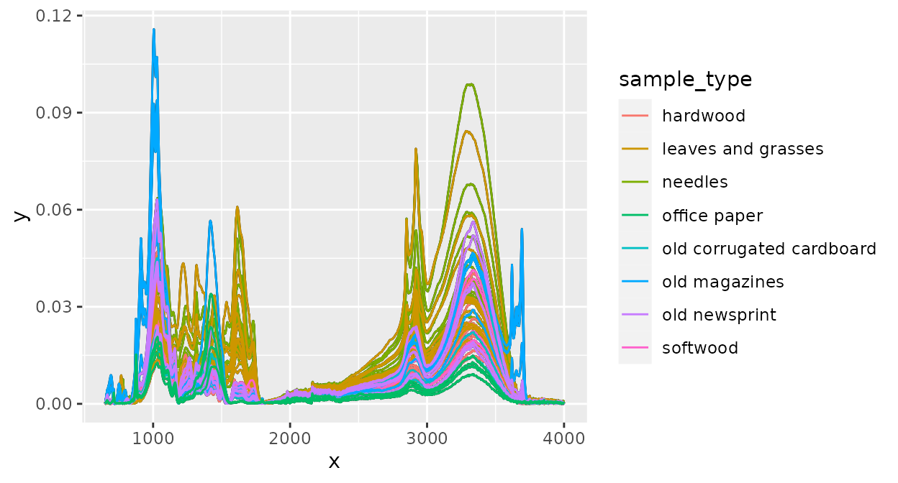

And of course, we can change axis labels, layout, etc, to create plots
nice enough for publications:

``` r
plot(d_csv) + 
  geom_path(aes(color = sample_type)) +
  labs(x = expression("Wavenumber ["*cm^{-1}*"]"), y = "Absorbance") +
  guides(color = guide_legend(title = "Sample type")) +
  theme_classic() +
  theme(legend.position = "bottom")
```

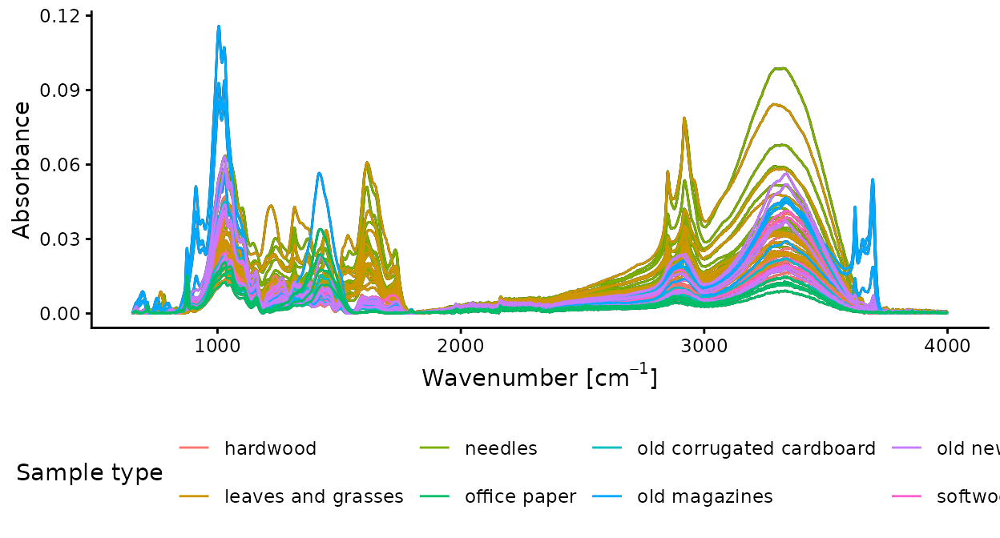

## Spectral preprocessing

‘ir’ provides many functions for spectral preprocessing and I’ll show
how to use the most important ones. All other preprocessing functions
can be used in a similar way. To make it easier to compare the effect
each function has, we’ll have a look at the sample spectrum before any
preprocessing:

``` r
plot(d_spc)
```


### Baseline correction

Baseline correction with a rubberband algorithm (see the
`spc.rubberband` function in the
[‘hyperspec’](https://cran.r-project.org/package=hyperSpec) package):

``` r
d_spc |>
  ir_bc(method = "rubberband") |>
  plot()
```


### Normalization

Normalization of intensity values by dividing each intensity value by
the sum of all intensity values (note the different scale of the y axis
in comparison to the spectrum before any preprocessing):

``` r
d_spc |>
  ir_normalize(method = "area") |>
  plot()
```

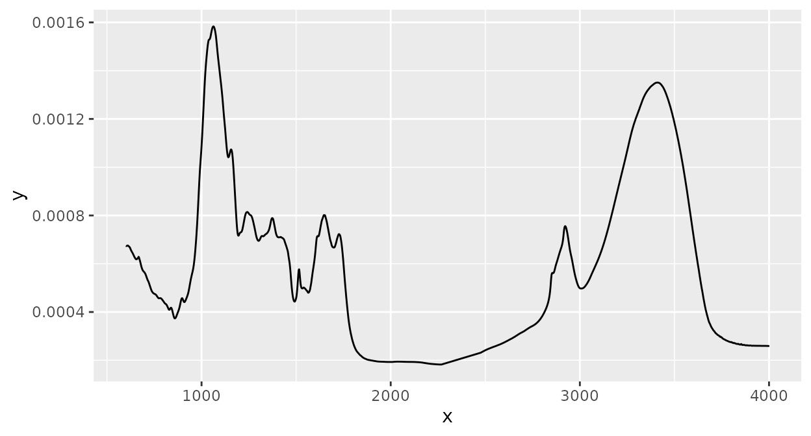

Normalization of intensity values by dividing each intensity value by
the the intensity value at a specific wavenumber (the horizontal and
vertical lines highlight that the intensity at the selected wavenumber
is 1 after normalization):

``` r
d_spc |>
  ir_normalize(method = 1090) |>
  plot() +
  geom_hline(yintercept = 1, linetype = 2) +
  geom_vline(xintercept = 1090, linetype = 2)
#> Warning: 1089.59485352039 selected instead of 1090.
```

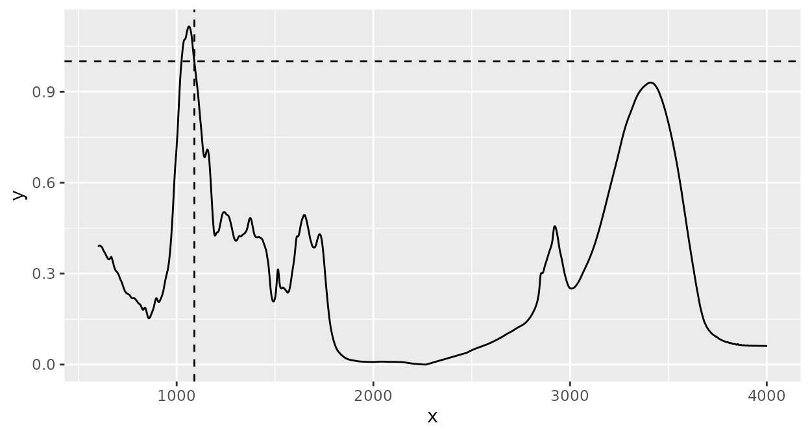

The warning just says that the spectrum’s wavenumber values did not
exactly match the desired value and therefore the nearest value
available was selected. To disable this warning, you can interpolate the
spectrum to an appropriate resolution (see section
[Interpolating](#interpolating) below).

### Smoothing

Smoothing of spectra with the Savitzky-Golay algorithm (see the
`sgolayfilt()` function from the
[‘signal’](https://cran.r-project.org/package=signal) package for
details):

``` r
d_spc |>
  ir_smooth(method = "sg", p = 3, n = 91, m = 0) |>
  plot()
```

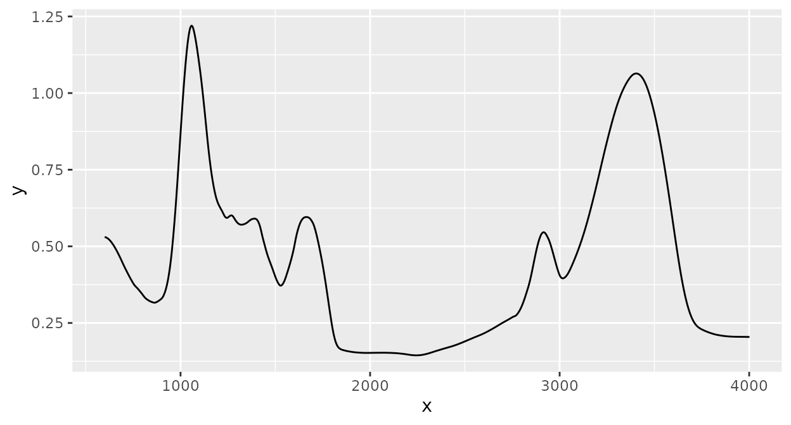

### Derivative spectra

Savitzky-Golay smoothing can also be used to compute derivative spectra
(here the first derivative is computed by setting the argument `m` to
`1`. See `?ir_smooth()` for more information):

``` r
d_spc |>
  ir_smooth(method = "sg", p = 3, n = 9, m = 1) |>
  plot()
```

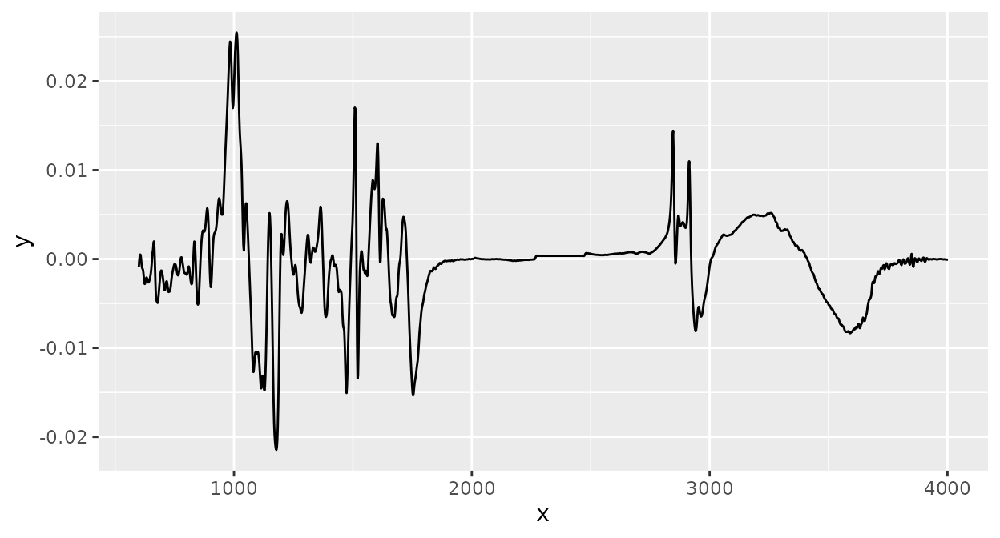

### Clipping

Spectra can be clipped to desired ranges for spectral channels (“x axis
values”, e.g. wavenumbers). Here, I clip the spectrum to the range
\[1000, 3000\]:

``` r
d_spc |>
  ir_clip(range = data.frame(start = 1000, end = 3000)) |>
  plot()
```

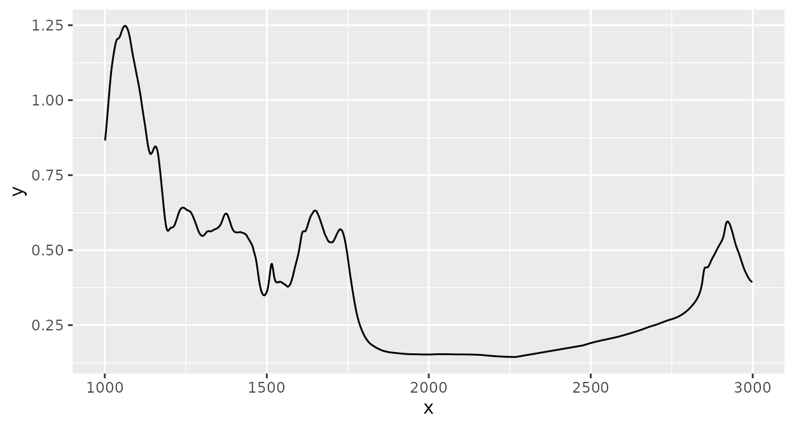

### Interpolating

Spectral interpolation (interpolating intensity values for new
wavenumber values) can be performed. Here, intensity values are
interpolated to integer wavenumbers increasing by 1 (by setting
`dw = 1`) within the range of the data:

``` r
d_spc |>
  ir_interpolate(dw = 1) |>
  plot()
```

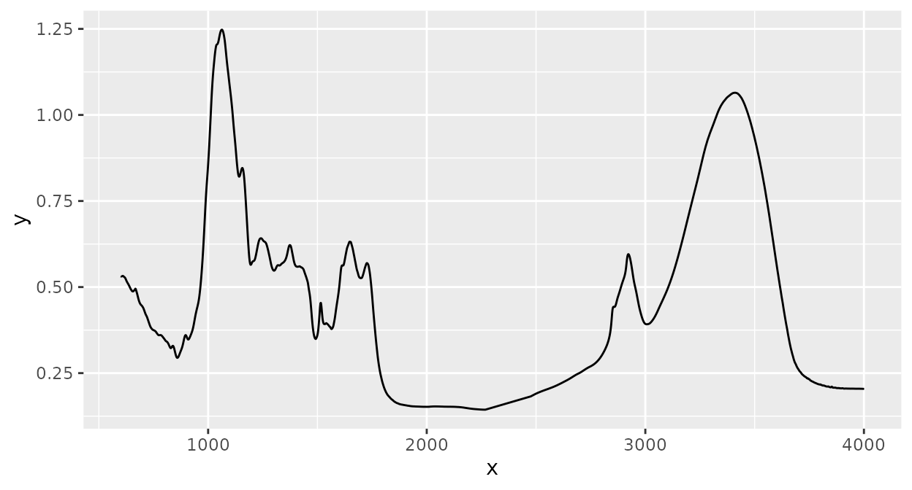

This is not easy to see from the plot, but the warning shown above
(section [Normalization](#normalization)) during normalization now does
not appear:

``` r
d_spc %>%
  ir_interpolate(dw = 1) |>
  ir_normalize(method = 1090) |>
  plot() +
  geom_hline(yintercept = 1, linetype = 2) +
  geom_vline(xintercept = 1090, linetype = 2)
```

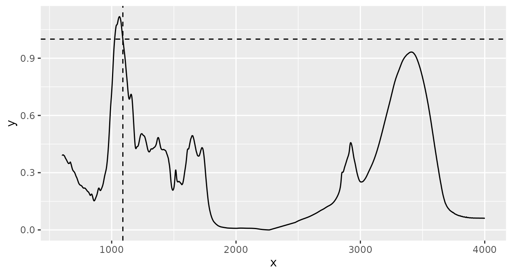

### Interpolating regions

Sometimes, it is useful to replace parts of spectra by straight lines
which connect the start and end points of a specified range. This can be
done with
[`ir_interpolate_region()`](https://henningte.github.io/ir/reference/ir_interpolate_region.md):

``` r
d_spc |>
  ir_interpolate_region(range = data.frame(start = 1000, end = 3000)) |>
  plot()
#> Warning: 1000.88447606564 selected instead of 1000.
#> • 3000.7249417305 selected instead of 3000.
```

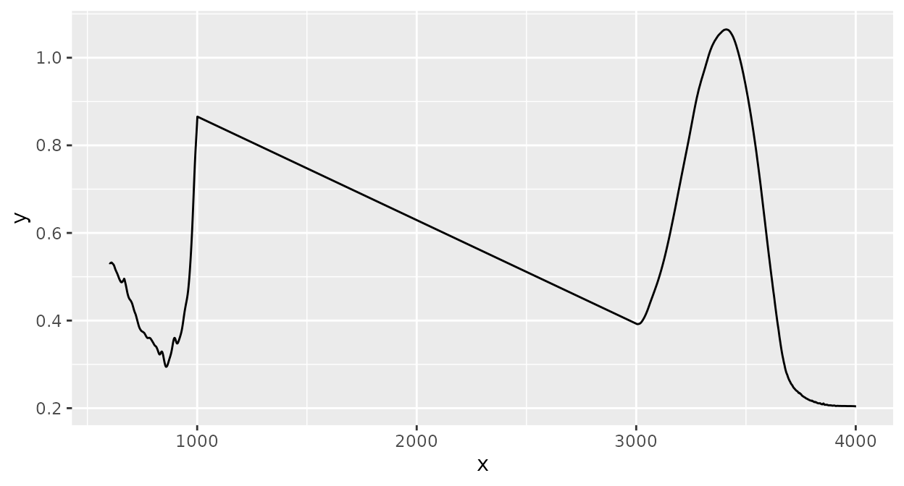

### Binning

Spectral binning collects all intensity values in contiguous spectral
ranges (“bins”) with specified widths and averages these:

``` r
d_spc |>
  ir_bin(width = 30) |>
  plot()
```

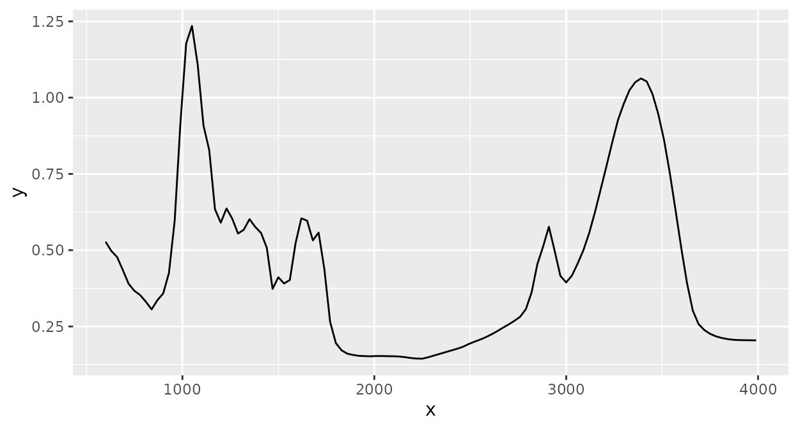

### Scaling

Scaling takes a set of spectra with the same x axis values and then
applies [`base::scale()`](https://rdrr.io/r/base/scale.html) on the
intensity values of all spectra for the same x axis value:

``` r
d_csv |>
  ir_scale(center = TRUE, scale = FALSE) |>
  plot()
```

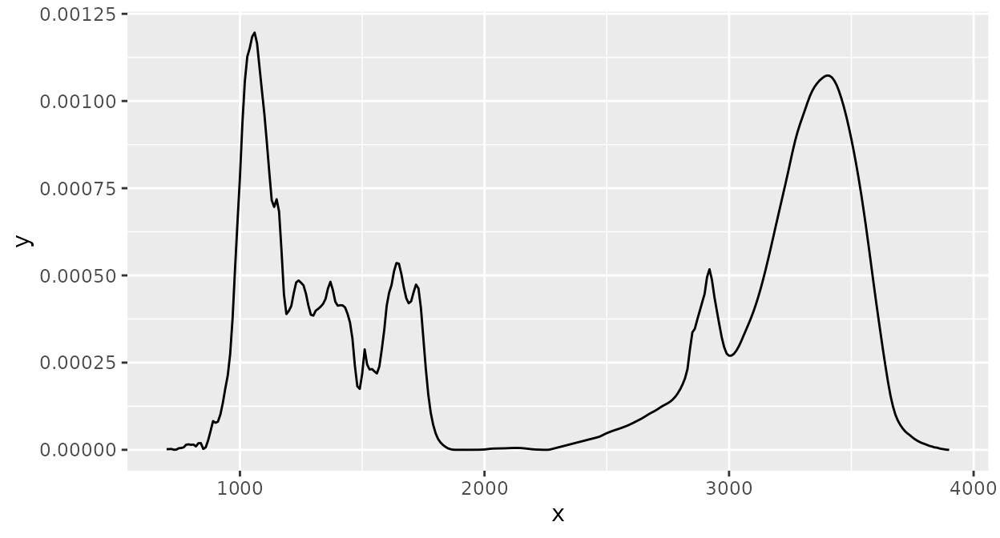

### Building preprocessing pipelines

With ‘ir’, it is very easy to build complex preprocessing workflows by
“piping” together different preprocessing steps (using the pipe (`%>%`)
operator in the
[‘magrittr’](https://cran.r-project.org/package=magrittr) package):

``` r
d_spc |>
  ir_interpolate(dw = 1) |>
  ir_clip(range = data.frame(start = 700, end = 3900)) |>
  ir_bc(method = "rubberband") |>
  ir_normalise(method = "area") |>
  ir_bin(width = 10) |>
  plot()
```

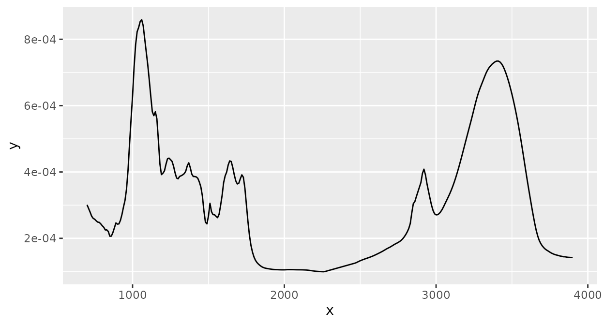

Now, we have a baseline corrected spectrum, `"area"` normalized, clipped
to \[650, 3900\], and binned to bin widths of 10 cm$^{- 1}$.

## Further information

Many more functions and options to handle and process spectra are
available in the ‘ir’ package. These are described in the documentation.
In the documentation, you can also read more details about the functions
and options presented here.

To learn more about the structure and general functions to handle `ir`
objects, see the vignette [Introduction to the
`ir`class](https://henningte.github.io/ir/articles/ir-class.md).

## Sources

The data contained in the `csv` file used in this vignette are derived
from Hodgkins et al. (2018)

## Session info

    #> R version 4.5.2 (2025-10-31)
    #> Platform: x86_64-pc-linux-gnu
    #> Running under: Ubuntu 24.04.3 LTS
    #> 
    #> Matrix products: default
    #> BLAS:   /usr/lib/x86_64-linux-gnu/openblas-pthread/libblas.so.3 
    #> LAPACK: /usr/lib/x86_64-linux-gnu/openblas-pthread/libopenblasp-r0.3.26.so;  LAPACK version 3.12.0
    #> 
    #> locale:
    #>  [1] LC_CTYPE=C.UTF-8       LC_NUMERIC=C           LC_TIME=C.UTF-8       
    #>  [4] LC_COLLATE=C.UTF-8     LC_MONETARY=C.UTF-8    LC_MESSAGES=C.UTF-8   
    #>  [7] LC_PAPER=C.UTF-8       LC_NAME=C              LC_ADDRESS=C          
    #> [10] LC_TELEPHONE=C         LC_MEASUREMENT=C.UTF-8 LC_IDENTIFICATION=C   
    #> 
    #> time zone: UTC
    #> tzcode source: system (glibc)
    #> 
    #> attached base packages:
    #> [1] stats     graphics  grDevices utils     datasets  methods   base     
    #> 
    #> other attached packages:
    #> [1] ggplot2_4.0.1    stringr_1.6.0    dplyr_1.1.4      ir_0.4.2        
    #> [5] kableExtra_1.4.0
    #> 
    #> loaded via a namespace (and not attached):
    #>  [1] tidyr_1.3.2         sass_0.4.10         generics_0.1.4     
    #>  [4] xml2_1.5.2          hyperSpec_0.100.3   jpeg_0.1-11        
    #>  [7] stringi_1.8.7       lattice_0.22-7      digest_0.6.39      
    #> [10] magrittr_2.0.4      evaluate_1.0.5      grid_4.5.2         
    #> [13] RColorBrewer_1.1-3  fastmap_1.2.0       jsonlite_2.0.0     
    #> [16] brio_1.1.5          purrr_1.2.1         viridisLite_0.4.2  
    #> [19] scales_1.4.0        lazyeval_0.2.2      textshaping_1.0.4  
    #> [22] jquerylib_0.1.4     Rdpack_2.6.5        cli_3.6.5          
    #> [25] rlang_1.1.7         rbibutils_2.4.1     withr_3.0.2        
    #> [28] cachem_1.1.0        yaml_2.3.12         otel_0.2.0         
    #> [31] tools_4.5.2         deldir_2.0-4        interp_1.1-6       
    #> [34] png_0.1-8           vctrs_0.7.1         R6_2.6.1           
    #> [37] lifecycle_1.0.5     fs_1.6.6            htmlwidgets_1.6.4  
    #> [40] MASS_7.3-65         ragg_1.5.0          pkgconfig_2.0.3    
    #> [43] desc_1.4.3          pkgdown_2.2.0       bslib_0.10.0       
    #> [46] pillar_1.11.1       gtable_0.3.6        Rcpp_1.1.1         
    #> [49] glue_1.8.0          systemfonts_1.3.1   xfun_0.56          
    #> [52] tibble_3.3.1        tidyselect_1.2.1    rstudioapi_0.18.0  
    #> [55] knitr_1.51          latticeExtra_0.6-31 farver_2.1.2       
    #> [58] htmltools_0.5.9     labeling_0.4.3      rmarkdown_2.30     
    #> [61] svglite_2.2.2       testthat_3.3.2      signal_1.8-1       
    #> [64] compiler_4.5.2      S7_0.2.1

## References

Hodgkins, Suzanne B., Curtis J. Richardson, René Dommain, Hongjun Wang,
Paul H. Glaser, Brittany Verbeke, B. Rose Winkler, et al. 2018.
“Tropical Peatland Carbon Storage Linked to Global Latitudinal Trends in
Peat Recalcitrance.” *Nature Communications* 9 (1): 3640.
<https://doi.org/10.1038/s41467-018-06050-2>.
